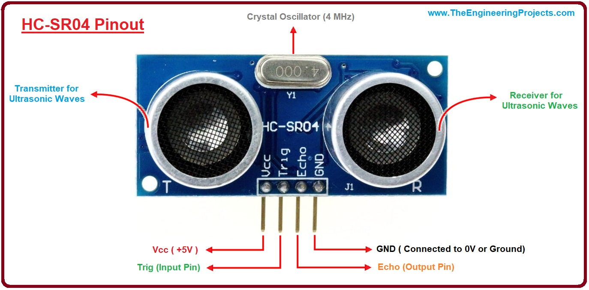

# Ultrasonic-Sensor-with-Arduino
Drive ultrasonic sensor with Arduino and measure distance in centimeter 


Today I will give you a tutorial on the Ultrasonic sensor HC-SR04 ! Also called as PING sensor or RANGE sensor.

# About Ultrasonic sensor HC-SR04
The transmitter transmits ultrasonic pulses or triger ultrasonic sound & they are reflected back or echo back & gets sensed by the receiver if any obstacle lies between the path.
The range of this ultrasonic is about 4 metres. There is a chance of error of +-3cm in measuring the distance.
It measures the time interval between sending & receiving the pulse & then by a formula – gives us the distance.

# Pin details



# Circuit Diagram


# Code for the Ultrasonic sensor

```
int trigPin = 8;
int echoPin = 9;
int led = 5;


void setup() {
  Serial.begin(9600); 
   pinMode(led, OUTPUT);
   pinMode(trigPin, OUTPUT);
  pinMode(echoPin, INPUT);
 

}

void loop() {
  long duration, distance;
  digitalWrite(trigPin,HIGH);
  delayMicroseconds(1000);
  digitalWrite(trigPin, LOW);
  duration=pulseIn(echoPin, HIGH);
  distance =(duration/2)/29.1;
  Serial.print(distance);
  Serial.println("CM");
  delay(10);
 
 if((distance<=10)) 
  {
    digitalWrite(led, HIGH);
}
   else if(distance>10)
 {
     digitalWrite(led, LOW);
   }
}
```
